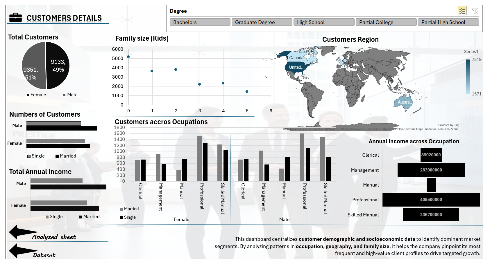

### Global Customer Demographic & Socioeconomic Dashboard with SQL & Excel

## Project Overview
This project centralizes **customer demographic and socioeconomic data** to identify dominant market segments across different geographical regions. The data was extracted from a primary **SQL Database** and analyzed in Excel to pinpoint high-value client profiles.

## Key Analytics & Insights
* **Geographical Spread**: Visualized the customer base across the **United States, Canada, Australia, and Europe** using a dynamic Map Chart.
* **Occupational Wealth**: Identified that **Professional** and **Management** roles account for the highest total annual income, exceeding **$409M** and **$283M** respectively.
* **Family Dynamics**: Analyzed family size (number of kids) to understand how household responsibilities impact purchasing power.
* **Gender & Marital Split**: Tracked the distribution of 18,484 total customers, showing a near-even split (51% Female, 49% Male).

## Technical Stack
* **SQL**: For initial data extraction and filtration of the core customer table.
* **Excel Pivot Tables**: Used to aggregate thousands of records by Degree, Region, and Occupation.
* **Interactive Slicers**: Stakeholders can filter the entire dashboard by **Education Level** (Bachelors, Graduate Degree, etc.).

